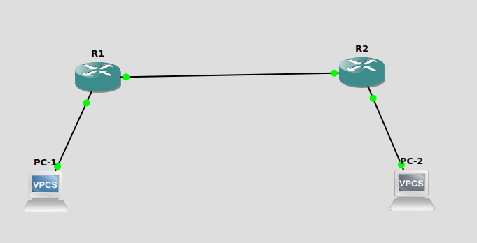

We will requiere 3 Routers (2 for  a,B 3 for C,D)
1. Connect Like this


2. interface setup
R1 0/0 -- 0/0 R2
R1 0/1 -- PC1
R2 0/1 -- PC2

R1
```
conf t
int loopback 1
ip address 192.168.0.1 255.255.255.0
no shutdown
exit
int loopback 2
ip address 192.168.1.1 255.255.255.0
no shutdown
exit
int fa 0/0 
ip address 192.168.2.1 255.255.255.0
no shutdown
exit
int fa 0/1 
ip address 192.168.3.1 255.255.255.0
no shutdown
exit
ip routing
ip classless
router rip
network 192.168.0.1
network 192.168.1.1
network 192.168.2.1
network 192.168.3.1


```

R2
```
conf t
int loopback 3
ip address 192.168.4.1 255.255.255.0
no shutdown
exit
int loopback 4
ip address 192.168.5.1 255.255.255.0
no shutdown
exit
int fa 0/0 
ip address 192.168.2.2 255.255.255.0
no shutdown
exit
int fa 0/1 
ip address 192.168.6.1 255.255.255.0
no shutdown
exit
ip routing
ip classless
router rip
network 192.168.4.1
network 192.168.5.1
network 192.168.2.2
network 192.168.6.1
```

SETUP PC 

PC1
```
ip 192.168.3.2
mask 255.255.255.0
gateway 192.168.3.1
```

PC1
```
ip 192.168.6.2
mask 255.255.255.0
gateway 192.168.6.1
```


===========================
A.2

R1
```
conf t
router rip
version 2
key chain name
key 2
key-string 0987654321
exit
int fa 0/0 
ip rip authen key-chain name
ip rip authen mode md5
exit
```

R2
```
conf t
router rip
version 2
version 2
key chain name
key 2
key-string 0987654321
exit
int fa 0/0 
ip rip authen key-chain name
ip rip authen mode md5
exit
```

test with pings if nohing is borked


====================================

zad B

connect like in A


R1
```
conf t
int loopback 1
shutdown
exit
int loopback 2
shutdown
exit
int fa 0/0 
ip address 200.200.201.1 255.255.255.0
no shutdown
exit
int fa 0/1 
ip address 200.200.200.1 255.255.255.0
no shutdown
exit
router ospf 150
network 200.200.200.0 0.0.0.255 area 0
network 200.200.201.0 0.0.0.255 area 0
```

R2
```
conf t
int loopback 3
shutdown
exit
int loopback 4
shutdown
exit
int fa 0/0 
ip address 200.200.201.2 255.255.255.0
no shutdown
exit
int fa 0/1 
ip address 200.200.202.1 255.255.255.0
no shutdown
exit
router ospf 150
network 200.200.202.0 0.0.0.255 area 0
network 200.200.201.0 0.0.0.255 area 0
```

PC1
```
ip: 200.200.200.2
mask: 255.255.255.0
gateway 200.200.200.1
```
PC1
```
ip: 200.200.202.2
mask: 255.255.255.0
gateway 200.200.202.1
```

test with ping

R1
```
conf t
router ospf 150
network 200.200.200.0 0.0.0.255 area 0
network 200.200.201.0 0.0.0.255 area 1
do sh ip ospf interface 
area 1 virtual-link r2-ip-addr
```

R2
```
conf t
router ospf 150
network 200.200.202.0 0.0.0.255 area 2
network 200.200.201.0 0.0.0.255 area 1
area 1 virtual-link r1-ip-addr
do sh ip ospf interface 
```
ping that ball back and forth


========================================

R1 fa 0/0 -- fa 0/0 R2
R1 fa 0/1 -- PC1

R2 fa 0/1 -- R3

R1
```
conf t
int loopback 1
ip address 192.168.2.1 255.255.255.0
no shutdown
exit
int fa 0/0 
ip address 192.168.0.1 255.255.255.0
no shutdown
exit
int fa 0/1 
ip address 192.168.1.1 255.255.255.0
no shutdown
exit
ip routing
ip classless
router rip
network 192.168.0.1
network 192.168.1.1
network 192.168.2.1
```

R2
```
conf t
int fa 0/0 
ip address 192.168.0.2 255.255.255.0
no shutdown
exit
int fa 0/1 
ip address 192.168.1.1 255.255.255.0
no shutdown
exit
ip routing
ip classless
router ospf 150
redistribute rip metric 11 
network 192.168.1.1 0.0.0.255 area 0
router rip
redistribute ospf 150 metric 12
network 192.168.0.2
```
```
conf t
conf t
int loopback 2
ip address 192.168.4.1 255.255.255.0
no shutdown
int fa 0/0 
ip address 192.168.1.2 255.255.255.0
no shutdown
exit
int fa 0/1 
ip address 192.168.3.1 255.255.255.0
no shutdown
exit
ip routing
ip classless
router ospf 150
redistribute rip metric 11 
network 192.168.1.2 0.0.0.255 area 0
network 192.168.3.1 0.0.0.255 area 0
network 192.168.4.1 0.0.0.255 area 0
```
EIGRP nie ogarniałem bo w D wracamu do tego OSPF i nie ma go opisanego 


========================================================================
D


R1
```
conf t
int loopback 1
ip address 192.168.2.1 255.255.255.0
no shutdown
exit
int fa 0/0 
ip address 192.168.0.1 255.255.255.0
no shutdown
exit
int fa 0/1 
ip address 192.168.1.1 255.255.255.0
no shutdown
exit
ip routing
ip classless
router rip
network 192.168.0.1
network 192.168.1.1
network 192.168.2.1
```

R2
```
conf t
int fa 0/0 
ip address 192.168.0.2 255.255.255.0
no shutdown
exit
int fa 0/1 
ip address 192.168.1.1 255.255.255.0
no shutdown
exit
ip routing
ip classless
router ospf 150
redistribute rip metric 11 
network 192.168.1.1 0.0.0.255 area 0
router rip
redistribute ospf 150 metric 12
network 192.168.0.2
```
```
conf t
conf t
int loopback 2
ip address 192.168.4.1 255.255.255.0
no shutdown
int fa 0/0 
ip address 192.168.1.2 255.255.255.0
no shutdown
exit
int fa 0/1 
ip address 192.168.3.1 255.255.255.0
no shutdown
exit
ip routing
ip classless
router ospf 150
redistribute rip metric 11 
network 192.168.1.2 0.0.0.255 area 0
network 192.168.3.1 0.0.0.255 area 0
network 192.168.4.1 0.0.0.255 area 0
```
