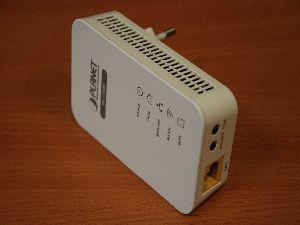
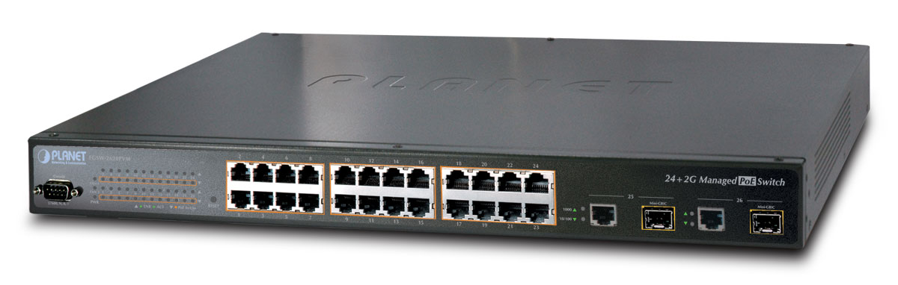
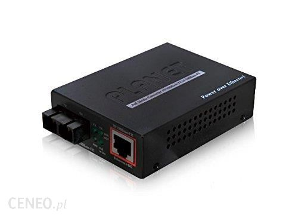
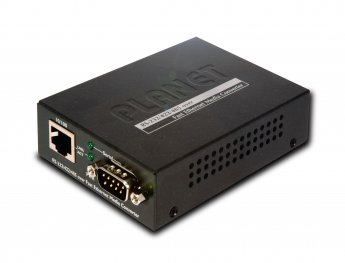

Zadanie A - PLC
============


1. [ PC-PEŁNOPRAWNY ]->[ PLC ][ ][ ][ ][ PLC ]<-[ OUTSIDE ]
2. TEST [NEWTORK SPEED](http://www.speedtest.pl/)
3. done i guess?

Zadanie B - PoE
==============

B.1 - PLANET
--------------
1. znaleźć tajemne urządzenie o nazwie `PoE PLANET FGSW` 
2. znaleźć 2 urządzenie które przyjmie tę moc - coś z `Planet` w nazwie np. 
3. podłączyć do siebie
4. ???
5. światełka się świecą więc jest OK?

B.2 - CISCO
--------------
teraz to samo tylko z CISCO

1. znależć przełącznik z funkcją inline-power (szukać POE na obudowie i mieć nadzieję że działa - CISCO nam nisetety nie chce powidzieć i katalog też jakie urzadzenia to mają)
2. znaleźć parę Accespiontów Cisco - chyba są przymontowane do ścian
3. w switchu
```
 show power inline
```


Zadanie C - RS232 - muh favourite
===================
- 2x 
- (default IP = 192.168.0.100 admin/admin)
- (jeśli niema domyślnych ustawień powinien być przycisk reset)
- 'zkonfigurować adresację ip i agenta SNMP'
- Serial communication port 9600 8 N 1 N
- teraz wyjmij kartkę i miej nadzieję że coś ci pomoże bo nic nie pisze na niej sensownego
