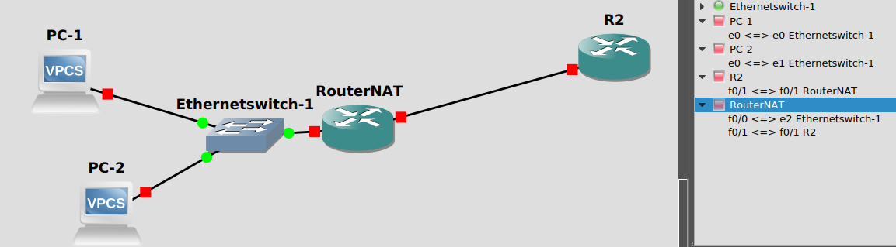
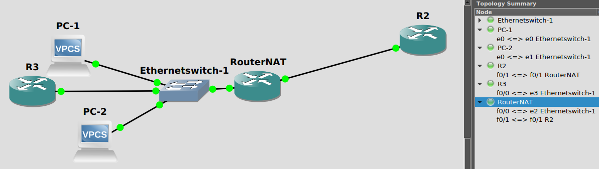

Zadanie A - overload
============================


a)
R2
```
en
conf t
hostname R2
int fa 0/1
ip address 192.168.1.1 255.255.255.0
no shutdown
exit
ip routing
ip http server
line vty 0 4
password sieci
login
exit
exit
debug ip tcp transactions
```

RouterNAT
```
en
conf t
hostname RouterNAT
ip routing


access-list 5 permit 192.168.2.0 0.0.0.255
ip nat inside source list 5 interface fa 0/1 overload
int fa 0/1
ip nat outside
ip address 192.168.1.2 255.255.255.0
no shutdown
exit
int fa 0/0
ip address 192.168.2.1 255.255.255.0
ip nat inside
no shutdown
exit
do debug ip nat
do debug ip icmp
```

PC1 192.168.2.2 255.255.255.0 192.168.2.1

PC2 192.168.2.3 255.255.255.0 192.168.2.1


podczas testów na RouterNAT wpisywać co jakiś czas:
```
show ip nat translations
show ip nat statistics
```
test ping:

+  wireshark na PC
+  ping 192.168.1.1
+ porównać ip w wireshark i na routerze

test TCP:

- przeglądarką na 192.168.1.1
- popatrzeć na logi R2 (nie wiem czy działa nie miałem jak tego sprawdzić)

RouterNAT
```
conf t
no ip nat inside source list 5 interface fa 0/1 overload
ip nat inside source list 5 interface fa 0/0 overload
exit
```
powtórzyć powyszsze testy

posprzątać:
RouterNAT
```
conf t
no ip nat inside source list 5 interface fa 0/1 overload
no ip nat inside source list 5 interface fa 0/0 overload
no access-list 5 permit 192.168.2.0 0.0.0.255
exit
```
Zadanie B - DMZ
============================
RouterNAT
```
conf t
ip nat inside source static 192.168.2.2 192.168.1.3
ip nat inside source static 192.168.2.3 192.168.3.3
exit
```
R2
```
conf t
ip route 192.168.3.0 255.255.255.0 192.168.1.2
exit
```

ping z PC-1 PC-2 192.168.1.1 zobacz że ip się zmieniają w NATrouter
cleanup
RouterNAT
```
conf t
no ip nat inside source static 192.168.2.2 192.168.1.3
no ip nat inside source static 192.168.2.3 192.168.3.3
exit
```
R2
```
conf t
no ip route 192.168.3.0 255.255.255.0 192.168.1.2
exit
```

Zadanie C - port forwarding
============================
podłącz 3 router :smile:



R3
```
en
conf t
hostname R3
int f0/0
ip address 192.168.2.4 255.255.255.0
no sh
exit
ip http server
line vty 0 4
password sieci
login
transport input telnet
exit
ip route 0.0.0.0 0.0.0.0 192.168.2.1
debug ip tcp transactions
```

RouterNAT
```
ip nat inside source static tcp 192.168.2.4 23 192.168.1.3 100
ip nat inside source static tcp 192.168.2.4 80 192.168.1.3 200

```

Test:
R2
```
telnet 192.168.1.3 100
telnet 192.168.1.3 200
```
