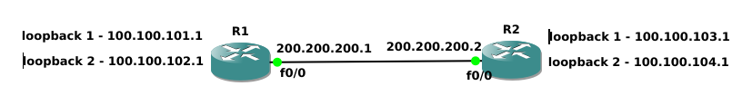
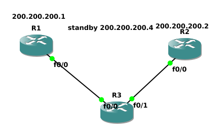

3 Routery Cisco
1 switch

Zadanie A
========================



R1
```
conf t
hostname R1
int loopback 1
ip address 192.168.101.1 255.255.255.0
no shutdown
exit
int loopback 2
ip address 192.168.102.1 255.255.255.0
no shutdown
exit
int fa 0/0
ip address 200.200.200.1 255.255.255.0
no shutdown
exit
ip routing
ip classless
ip route 0.0.0.0 0.0.0.0 192.168.101.1
ip route 192.168.104.0 255.255.255.0 200.200.200.2
ip route 192.168.103.0 255.255.255.0 200.200.200.2
ip route 192.168.101.0 255.255.255.0 200.200.200.1
ip route 192.168.102.0 255.255.255.0 200.200.200.1
router rip
network 192.168.101.1
network 192.168.102.1
network 192.168.103.1
network 192.168.104.1
network 200.200.200.1
network 200.200.200.2
redistribute static
exit
```

R2
```
conf t
hostname R2
int loopback 1
ip address 192.168.103.1 255.255.255.0
no shutdown
exit
int loopback 2
ip address 192.168.104.1 255.255.255.0
no shutdown
exit
int fa 0/0
ip address 200.200.200.2 255.255.255.0
no shutdown
exit
ip routing
ip classless
router rip
network 192.168.101.1
network 192.168.102.1
network 192.168.103.1
network 192.168.104.1
network 200.200.200.1
network 200.200.200.2
exit
```

test pings

Zadanie D XD
========================


R1
```
conf t

no ip route 0.0.0.0 0.0.0.0 192.168.101.1
no ip route 192.168.104.0 255.255.255.0 200.200.200.2
no ip route 192.168.103.0 255.255.255.0 200.200.200.2
no ip route 192.168.101.0 255.255.255.0 200.200.200.1
no ip route 192.168.102.0 255.255.255.0 200.200.200.1

int fa 0/1
ip address 200.200.202.1 255.255.255.0
no shutdown
access-list 105 permit ip 200.200.202.0 0.0.0.255 200.200.201.0 0.0.0.255
access-list 105 deny ip any any

route-map mapa1 permit 10
match ip address 105
set interface fa 0/1
set ip next-hop 200.200.200.2
exit

int fa 0/1
no ip route-cache
ip policy route-map mapa1
exit
```

R2
```
conf t
int fa 0/1
ip address 200.200.201.1 255.255.255.0
no shutdown
access-list 105 permit ip 200.200.201.0 0.0.0.255 200.200.202.0 0.0.0.255
access-list 105 deny ip any any


route-map mapa1 permit 10
match ip address 105
set interface fa 0/1
set ip next-hop 200.200.200.1
exit

int fa 0/1
no ip route-cache
ip policy route-map mapa1
exit
```
Zadanie C
========================

configuration change

R1
```
conf t
int fa 0/0
ip address 200.200.200.1 255.255.255.0
standby 1 ip 200.200.200.4
standby 1 priority 140
standby 1 preempt
no shutdown
exit
exit
debug ip icmp
```

R2
```
conf t
int fa 0/0
ip address 200.200.200.2 255.255.255.0
standby 1 ip 200.200.200.4
standby 1 priority 90
standby 1 preempt
no shutdown
exit
exit
debug ip icmp
```

ping na bramkę
sprawdić który odpowie , zmieniś priorytet -sprawdić jeszcze raz
sasymulaować
sprawdzić jeszcze raz

zmienimy protokół

R1
```
conf t
int fa 0/0
ip address 200.200.200.1 255.255.255.0
no standby 1
vrrp 1 ip 200.200.200.4
vrrp 1 priority 110
arrp 1 preempt
no shutdown
exit
exit
debug ip icmp
```

R2
```
conf t
int fa 0/0
ip address 200.200.200.2 255.255.255.0
no standby 1
vrrp 1 ip 200.200.200.4
vrrp 1 priority 100
arrp 1 preempt
no shutdown
no shutdown
exit
exit
debug ip icmp
```

zrobić to samo co wyżej

optional:
R1
```
conf t
track 1 fa 0/1 line-protocol
int fa 0/0
vrrp 1 track 1 decrement 20
no shutdown
exit
exit
debug ip icmp
```

Zadanie D
========================


PROBLEM IP Interface R3 -possible fix dać do róznych sieci  -trochę mało akceptowalne ale może działać
possible fix 2 puścić przez switcha
problem wersji

```
conf t
hostname R3

int fa 0/0
no shut
exit

int fa 0/1
no shutdown
exit
```

Wersja nowsza
```
ip sla 4
icmp-echo 200.200.200.1 source-interface FastEthernet0/0
timeout 1000
threshold 2
frequency 3
exit
ip sla schedule 4 life forever start-time now

track 11 rtr 5 reachability
ip route 0.0.0.0 0.0.0.0 200.200.200.1 track 11
ip route 0.0.0.0 0.0.0.0 200.200.200.2  7
exit
```

wersja Starsza
```
conf t
ip sla monitor 4
type echo protocol ipicmpEcho 200.200.200.1 source-interface FastEthernet0/0
timeout 1000
threshold 2
frequency 3
exit
ip sla monitor schedule 4 life forever start-time now
track 11 rtr 5 reachability
ip route 0.0.0.0 0.0.0.0 200.200.200.1 track 11
ip route 0.0.0.0 0.0.0.0 200.200.200.2  7
exit
```
