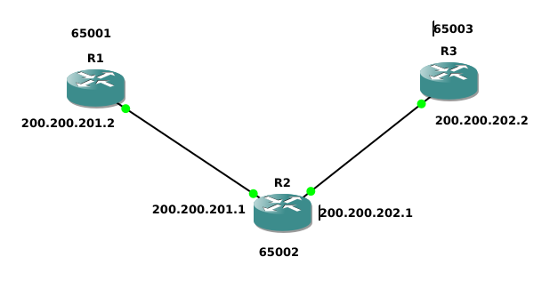
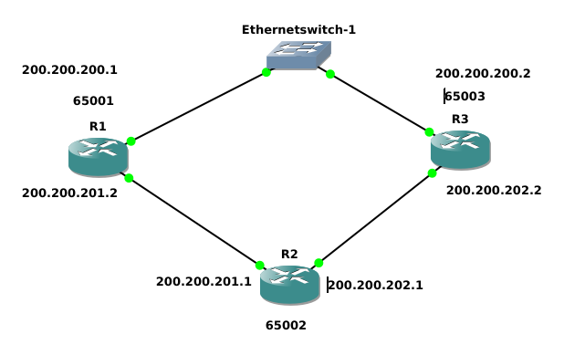
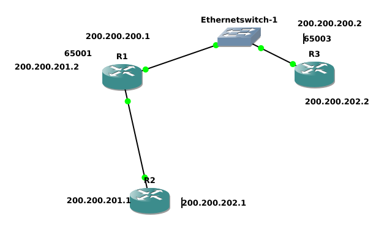

087
=============


Zadanie A
============
Połączyć jak na rysunku i ustawić ip

R1
```
en
conf t
hostname R1
int fa 0/0
no shu
ip address 200.200.201.2 255.255.255.0
ex
```

R2
```
en
conf t
hostname R2
int fa 0/0
no shu
ip address 200.200.201.1 255.255.255.0
ex
int fa 0/1
no shu
ip address 200.200.202.1 255.255.255.0
ex
```

R3
```
en
conf t
hostname R3
int fa 0/0
no shu
ip address 200.200.202.2 255.255.255.0
ex
```

Zadanie B
============

R1
```
conf t
ip routing
no parser cache
router bgp 65001
neighbor 200.200.201.1 remote-as 65002
network 200.200.201.0 mask 255.255.255.0
do debug ip bgp
```

R2
```
conf t
ip routing
no parser cache
router bgp 65002
neighbor 200.200.201.2 remote-as 65001
neighbor 200.200.202.2 remote-as 65003
do debug ip bgp

```

R3
```
conf t
ip routing
no parser cache
router bgp 65003
neighbor 200.200.202.1 remote-as 65002
network 200.200.202.0 mask 255.255.255.0
do debug ip bgp
```


spr - wpisać do wszystkich
```
do show ip bgp
do show ip bgp summary
```


R1
```
conf t
int loop 1
ip addr 200.200.210.1 255.255.255.0
router bgp 65001
network 200.200.210.0
```

R2
```
conf t
int loop 1
ip addr 200.200.220.1 255.255.255.0
router bgp 65002
network 200.200.220.0
```

R3
```
conf t
int loop 1
ip addr 200.200.230.1 255.255.255.0
router bgp 65003
network 200.200.230.0
```

R3
```
show ip bgp 200.200.210.0/24
```

R3
```
router bgp 65003
no network 200.200.202.0 mask 255.255.255.0
do ping 200.200.202.1
clear ip bgp *
```


```
route-mapa mapa
set metric 123456
set origin incomplete
```

Zadanie C
================

no idea lts do it last

Zadanie D
=================

R1
```
conf t
int fa 0/1
no shu
ip addr 200.200.200.1 255.255.255.0
router bgp 65001
neighbor 200.200.200.2 remote-as 65003
```

R3
```
conf t
int fa 0/1
no shu
ip addr 200.200.200.2 255.255.255.0
router bgp 65003
network 200.200.200.0
neighbor 200.200.200.1 remote-as 65001
```

zadanie E
=====================
R3
```
conf t
access-list 15 deny 200.200.230.0 0.255.255.255
access-list 15 permit 0.0.0.0 255.255.255.255

route-map nie_wysyłaj_doR1 permit 10
match ip address 15

access-list 16 deny 200.200.220.0 0.255.255.255
access-list 16 permit 0.0.0.0 255.255.255.255

route-map nie_odbieraj_doR1 permit 10
match ip address 16

router bgp 65003
neighbor 200.200.200.1 route-map nie_wysyłaj_doR1 out
neighbor 200.200.200.1 route-map nie_odbieraj_doR1 in

```

Zadanie F
=============


R2
```
no router bgp 65002
router rip
network 200.200.210.0
network 200.200.201.0
version 2
```

R1
```
router bgp 65001
no neighbor 200.200.201.1 remote0as 65002
redistribute-internal

router rip
network 200.200.220.0
network 200.200.201.0
version 2
redistribute gbp 65001 metric 12

```
R3
```
router bgp 65003
no neighbor 200.200.202.1 remote0as 65002

```
