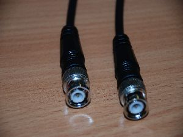

059
====

2 routery: cisco 3600 i 7200 VXR
z modułami T3/e3

połączyć 75ohm kablem koncentrycznym rx kzryżując z tx


2kable



#Zadanie A
1. połączyć routery kablami RCLK / LED RX CARRIER powinna migać po obu stronach

R1
```
conf t
en
host R1
ip routing
interf atm 2/0
no shut
ip addess 200.200.200.1 255.255.255.0
pvc 1/32
protocol ip 200.200.200.2 broadcast
exit
int fa0/0
ip address 200.200.201.1 255.255.255.0
no shut
ex
ip route 200.200.202.0 255.255.255.0 200.200.200.2
```

R2
```
conf t
en
host R1
ip routing
interf atm 2/0
no shut
ip addess 200.200.200.2 255.255.255.0
pvc 1/32
protocol ip 200.200.200.1 broadcast
exit
int fa0/0
ip address 200.200.202.1 255.255.255.0
no shut
ex
ip route 200.200.201.0 255.255.255.0 200.200.200.1
```

check
```
show int atm 2/0
show controller atm 1/0
show atm vc
show atm vp
```
ping the shit out of it

dodać dwa kompy do osobnych sieci 
