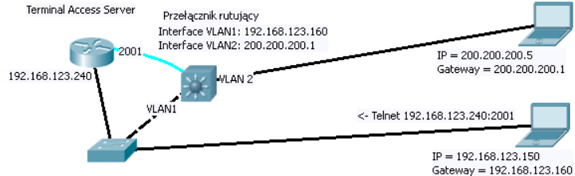

# Konfigurowanie przełączników rutujących HP ProCurve

## Zadanie A

Przygotować przełącznik `HP ProCurve 2650`

1. 
2. sprawdzić czy IP nie są zajęte
3. wpisać:

```CISCOIOS
en
conf t
vlan 1
ip address 192.168.123.160 255.255.255.0
ex
vlan 2
ip address 200.200.200.1 255.255.255.0
ex
```

## Zadanie B

```CISCOIOS
conf t
telnet-server
web-manamement
do show telnet
```

podłączyć się przez web i telnet 

```CICCOIOS
conf t
ip ssh key-size 1024
crypto key generate
#ip ssh port 122
ip ssh
show ip ssh
```

podłączyć przez SSH

## Zadanie C

znaleźć inny przełącznik

```CISCOIOS
conf t
do show vlan
vlan 1
ip address 192.168.123.161 255.255.255.0
tagged przełączikB
ex
vlan 2
ip address 200.200.200.2 255.255.255.0
tagged przełączikB
ex
```

## Zadanie D

```CISCOIOS
snmp-server community "public" unrestricted
```

poza tym jest bullshit na kartce- nie ma nic konkretnego do zrobienia

## Zadanie E

```CISCIOIOS
vlan 3
ip address 200.200.201.2 255.255.255.0
ex
ip routing
ip route networkIP 255.255.255.0 targetIP
```

## Zadanie F

zalogować się przez WWW.
