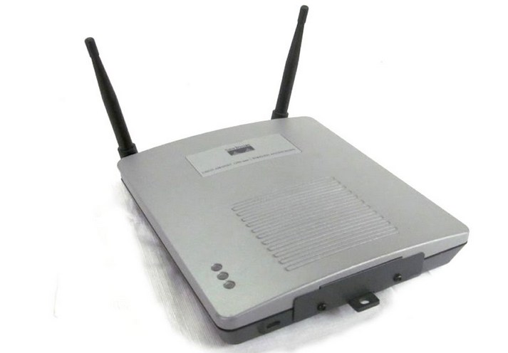
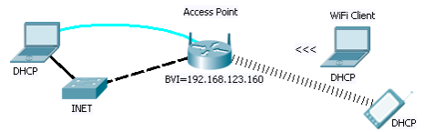
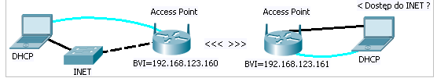

# Konfigurowanie sieci bezprzewodowych CISCO IOS. CISCO AIRONET 1200 035

## Zadanie A : podstawowa konfiguracja punktu dostępowego Cisco Aironet, Konfigurowanie SSID WPA

### Przydatne do zrobienia tego zadania

+ 2 Hosty
+ połączenie z Internet
+ telefon/laptop po podłączenia
+ 2 AccessPoint Cisco Aironet 1200





### Logowanie do CLI

hasło-domyślne: `Cisco`,

konfiguracja zapisana w `flash:config.txt` - reset fabryczny to usunięcie tego pliku

domyślnie jest WWW aktywny L:`Cisco`, P:`Cisco`

### Mostek BVI

musimy mu nadać IP - należy zmostkować fa i wifi
not sure if this but well 

```CISCOIOS
conf t
bridge irb

interface FastEthernet0/0
 no ip address
 no shutdown
 bridge-group 1

interface FastEthernet0/1

 no ip address

 no shutdown

 bridge-group 1

!

interface BVI1

 ip address 10.0.0.1 255.255.255.0

 no shutdown

!

bridge 1 route ip
exit
```

### DHCP

domyślnie AP jest klientem DHCP (yay)
można ustawić bramę domyślną przez:

```CISCOIOS
conf t
ip default-gateway 192.168.123.254
exit
```

### wifi

interfejsy to:

- dot11radio 0 (Radio0-802.11B - 802.11B)
- dot11radio 1 (Radio0-802.11A - 802.11G) - our choice - the internet says it should work

### SSID

```CISCOIOS
conf t
dot11 ssid test
auth open
auth key WPA
wpa-psk ascii 12345678
guest-mode
exit
```

### ANTENY = NOPE

```CISCOIOS
int dot11radio 1
encryption mode ciphers tkip
ssid test
no sh
```

### Diagnostyka:

SSID

```CISCOiOS
show dot11 bssid
```

WIFI

``` CICCOiOS
show dot11 statistics client-traffic
show dot11 mac-authen filter-cache
show dot11 assiciations
show dot11 assiciations all
```

AP

```Cicsoios
show arp
show ip int brief
```

### Alltogether now


```CISCOIOS
conf t
hostname AP
bridge irb


ip default-gateway 192.168.123.254

dot11 ssid test
auth open
auth key WPA
wpa-psk ascii 12345678
guest-mode
exit

int dot11radio 1
encryption mode ciphers tkip
ssid test
 bridge-group 1
no sh


interface FastEthernet0/0
 no ip address
 no shutdown
 bridge-group 1

interface BVI1
 ip address 192.168.123.254 255.255.255.0
no shutdown

bridge 1 route ip
exit
```

test it out i guess

## Zadanie B: WEP-128

Pierwsze zdanie - don't use it like ever.
ogólnie chodzi tylko o zmianę szyfrowania w powyższym zadaniu

```CISCIOIOS
conf t
no dot11 ssid test
dot11 ssid test
auth open
wpa-psk ascii 12345678
guest-mode
exit

int dot11radio 1
ssid test
encryption key 3 size 128 09876543210987654321098765
transmit-key
encryption mode ciphers wep128
broadcast-key change 200
no sh
exit
```

## Zadanie C Mostki Wifi pomiędzy UTP

Trzeba zmienić połączenie na takie:


I trzeba zrobić reset obu  teraz

### Nazwy:

+ 160 - rootbridge
+ 161 - client

### rootbridge

```CISCOIOS
conf t
hostname rootbridge
bridge irb

ip default-gateway 192.168.123.160

dot11 ssid test
auth open
guest-mode
exit

int dot11radio 1
 station-role root bridge
 ssid test
 no shut
 bridge-group 1
no sh


interface FastEthernet0/0
 no ip address
 no shutdown
 bridge-group 1

interface BVI1
 ip address 192.168.123.160 255.255.255.0
no shutdown

bridge 1 route ip
exit
```

### client

```CISCOIOS
conf t
hostname client
bridge irb

ip default-gateway 192.168.123.161

dot11 ssid test
auth open
guest-mode
exit

int dot11radio 1
 station-role non-root bridge
 ssid test
 bridge-group 1
 no sh
exit


interface FastEthernet0/0
 no ip address
 no shutdown
 bridge-group 1

interface BVI1
 ip address 192.168.123.161 255.255.255.0
no shutdown

bridge 1 route ip
exit
```

### Optional - dodać szyfr do tego mostka

W obu AP

```CiSCOIOS
int dot11radio 1
encryption mode ciphers tkip
exit
dot 11 ssid test
auth key wpa
wpa-psk ascii 123345678
exit
```

## zadanie D: Mostki Wifi z udostępnianiem AP

dodanie do powyższego zadania możliwośći podłączenia się do AP client
