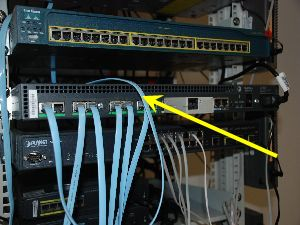
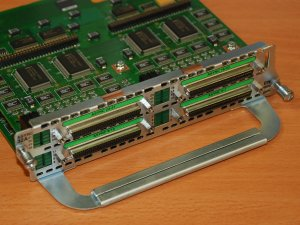

# 047 - Konfigurowanie TAS
Stanowisko 007

+ Cisco 2509RJ - TAS  

+ Moduł NM-32Async  


## Zadanie A - Fizyczne podłączenie

1. Podłączyć TAS do PC TP kablem i konsolę
2. Znaleźć inne urządzenie do skonfigurowania
3. Podłączyć znalezione urządzenie do TAS - odpowiednim kablem - pewnie niebieskim płaskim z 2 RJ45
4. Uruchomić serwer:  
```CISCOIOS
en
conf t 
int fa 0/0
ip address 192.168.1.1 255.255.255.0
no shut 
exit
```
5. PC IP: 192.168.1.2

## Zadanie B - Konfigurowanie połączeń

+ CTY - powiązane z console
+ TTY (1-8,1-16,32-64) powiązane z portami ASYNC (1-8,1-16,1-32)
+ AUX - powiązane z AUX
+ VTY - powiązane z serwerem programowym

1. sprawdzić status linii `show line` (`clear line ID`)
2. ustawić linie ASYNC  
```CISCOIOS
conf t
line 1 8
exec-timeout 0 0
no exec
transport input telnet
exit
```
3. ustawić linie VTY  
```CISCOIOS
conf t
line vty 1 8
password cisco
login
no exec
exit
```
4. podłączyć się telentem do portu 2000+nrportu ASYNC

## Zadanie C - Loopback because why the fuck not?

```
conf t 
int loopback 0
ip addr 10.10.10.10 255.255.255.255
no shut
exit
```

sprawdzić sprawdzić czy działa  
`telnet 10.10.10.10 2000+nrportu`  
`connect 10.10.10.10 2000+nrportu`  
zawieszenie połączenia `ctr+shift+6 x`
naeleży nawiązać z kolejnymi liniami VTY zawieszając je ale nie ończąś

```
show line 
show session
systat
```

potem wyczyścić zawieszone połączenia `clear line TYPE NR`
można zdefiniować konkretnego hosta 
`ip host name 10.10.10.10 port`